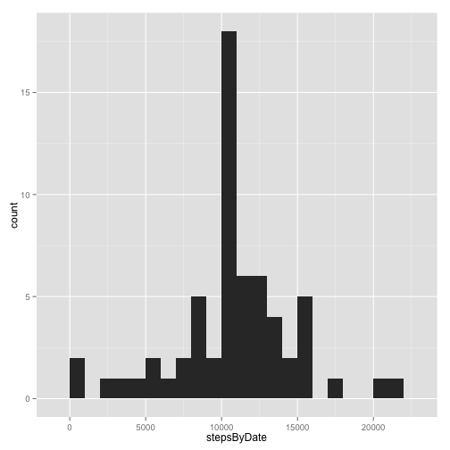

# Reproducible Research: Peer Assessment 1


```r
library(ggplot2)
library(stringr)
```


## Loading and preprocessing the data


```r
data <- read.csv("activity.csv", header = TRUE)
data$dateTime <- strptime(paste(data$date, str_pad(data$interval, 4, pad = "0")), 
    "%Y-%m-%d %H%M")
```


## What is mean total number of steps taken per day?

### This code produces a histogram of the total number of steps taken each day.


```r
totalStepsPerDay <- tapply(data$steps, data$date, sum, na.rm = TRUE)
qplot(totalStepsPerDay, binwidth = 1000)
```

 


### This code computes the mean of the total steps per day.


```r
mean(totalStepsPerDay)
```

```
## [1] 9354
```


### This code computes the median of the total steps per day.


```r
median(totalStepsPerDay)
```

```
## [1] 10395
```


## What is the average daily activity pattern?

### This code computes the mean of the steps taken in each interval across all days.


```r
averageStepsPerInterval <- tapply(data$steps, data$interval, mean, na.rm = TRUE)
intervalData <- data.frame(interval = dimnames(averageStepsPerInterval)[[1]], 
    meanSteps = averageStepsPerInterval)
```


### This is a graph of the mean steps taken in each interval across all days.


```r
qplot(strptime(str_pad(intervalData$interval, 4, pad = "0"), format = "%H%M"), 
    intervalData$meanSteps, geom = "line")
```

 


### This code finds the interval with the highest value.


```r
maximalIntervalIndex <- which.max(intervalData$meanSteps)
intervalData[maximalIntervalIndex, ]
```

```
##     interval meanSteps
## 835      835     206.2
```


## Imputing missing values

### This code computes the number of missing samples.


```r
missingValues <- is.na(data$steps)
sum(missingValues)
```

```
## [1] 2304
```


### Missing values will be replaced by first making a copy of the data.


```r
interpolatedData <- data.frame(data)
```


### Then replacing every NA with a best guess value.

The guess is computed by taking the mean of all non-NA values for the same interval across all days.


```r
replacementValues <- intervalData[as.character(interpolatedData$interval), 2]
interpolatedData$steps[missingValues] <- replacementValues[missingValues]
```


### This code produces a histogram of the total number of steps taken each day.


```r
totalStepsPerDay <- tapply(interpolatedData$steps, interpolatedData$date, sum)
qplot(totalStepsPerDay, binwidth = 1000)
```

 


### This code computes the mean of the total steps per day.


```r
mean(totalStepsPerDay)
```

```
## [1] 10766
```


### This code computes the median of the total steps per day.


```r
median(totalStepsPerDay)
```

```
## [1] 10766
```


### Impact of imputing values for NA:

Because whole days were missing, imputing values for the missing days replaced several days whose total was zero with days whose total is greater than zero. That increased the total number of steps and the mean.

Since those added days all had the same total, and were equal to the mean of all days, the median shifted to that same value.

## Are there differences in activity patterns between weekdays and weekends?

### Add a factor to the data frame indicating whether the sample was a weekday or weekend.


```r
weekdays <- weekdays(interpolatedData$dateTime)
interpolatedData$dayType <- factor(weekdays == "Saturday" | weekdays == "Sunday", 
    levels = c(FALSE, TRUE), labels = c("weekday", "weekend"), ordered = TRUE)
interpolatedData$weekday <- weekdays
```


### Plot the mean steps in each interval across all days, but divided into weekdays and weekends.


```r
p <- ggplot(interpolatedData, aes(strptime(str_pad(interval, 4, pad = "0"), 
    format = "%H%M"), steps))
p <- p + stat_summary(fun.y = mean, geom = "line")
p <- p + facet_grid(dayType ~ .)
p
```

 

