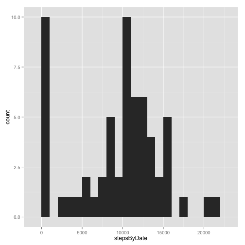
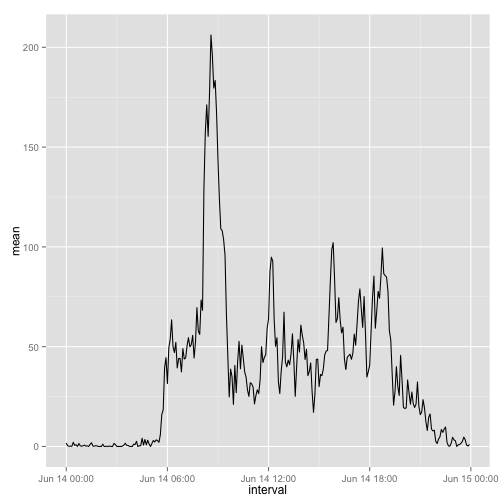
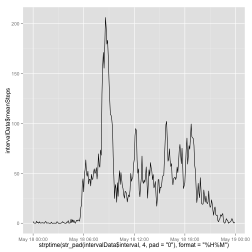
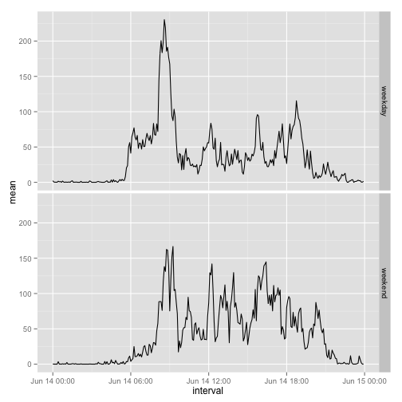

Reproducible Data, Week 2 Project
-----


```r
library(stringr)
library(ggplot2)
```


# Loading the Data


```r
unzip("activity.zip")
rawData = read.csv("activity.csv")
rawData$datetime = strptime(paste(rawData$date, str_pad(rawData$interval, 4, 
    pad = "0")), "%Y-%m-%d %H%M")
str(rawData)
```

```
## 'data.frame':	17568 obs. of  4 variables:
##  $ steps   : int  NA NA NA NA NA NA NA NA NA NA ...
##  $ date    : Factor w/ 61 levels "2012-10-01","2012-10-02",..: 1 1 1 1 1 1 1 1 1 1 ...
##  $ interval: int  0 5 10 15 20 25 30 35 40 45 ...
##  $ datetime: POSIXlt, format: "2012-10-01 00:00:00" "2012-10-01 00:05:00" ...
```


# Some Basic Statistics


```r
stepsByDate = tapply(rawData$steps, rawData$date, sum, na.rm = T)
qplot(stepsByDate, geom = "histogram", binwidth = 1000)
```

 


The mean is of the steps taken per day is 9354.2295 and the median is 10395.

Ignoring days that have zero steps (those days are all NA), the mean is 1.0766 &times; 10<sup>4</sup> and the median is 10765.

# Average Daily Activity Pattern

This plot shows the means steps across all days, for each 5-minute interval.


```r
temp = tapply(rawData$steps, rawData$interval, mean, na.rm = T)
meanStepsByInterval = data.frame(interval = strptime(str_pad(names(temp), 4, 
    pad = "0"), "%H%M"), mean = temp)
qplot(data = meanStepsByInterval, interval, mean, geom = "line")
```

 


This shows the interval with the largest mean number of steps across all days.


```r
meanStepsByInterval[which.max(meanStepsByInterval$mean), ]
```

```
##                interval  mean
## 835 2014-06-14 08:35:00 206.2
```


# Imputing Missing Values

Whenever a value is missing, we are going to replace the NA with the mean number of steps across all days that have values.

There are 2304 values missing.


```r
means = meanStepsByInterval[as.character(rawData$interval), "mean"]
imputedData = rawData
missingIndices = is.na(rawData$steps)
imputedData[missingIndices, "steps"] = means[missingIndices]
head(rawData)
```

```
##   steps       date interval            datetime
## 1    NA 2012-10-01        0 2012-10-01 00:00:00
## 2    NA 2012-10-01        5 2012-10-01 00:05:00
## 3    NA 2012-10-01       10 2012-10-01 00:10:00
## 4    NA 2012-10-01       15 2012-10-01 00:15:00
## 5    NA 2012-10-01       20 2012-10-01 00:20:00
## 6    NA 2012-10-01       25 2012-10-01 00:25:00
```

```r
head(imputedData)
```

```
##     steps       date interval            datetime
## 1 1.71698 2012-10-01        0 2012-10-01 00:00:00
## 2 0.33962 2012-10-01        5 2012-10-01 00:05:00
## 3 0.13208 2012-10-01       10 2012-10-01 00:10:00
## 4 0.15094 2012-10-01       15 2012-10-01 00:15:00
## 5 0.07547 2012-10-01       20 2012-10-01 00:20:00
## 6 2.09434 2012-10-01       25 2012-10-01 00:25:00
```


# Some Basic Statistics on the Imputed Data


```r
stepsByDate = tapply(imputedData$steps, imputedData$date, sum)
qplot(stepsByDate, geom = "histogram", binwidth = 1000)
```

 


The mean is of the steps taken per day is 1.0766 &times; 10<sup>4</sup> and the median is 1.0766 &times; 10<sup>4</sup>.

# Average Daily Activity Pattern

This plot shows the means steps across all days, for each 5-minute interval.


```r
temp = tapply(imputedData$steps, imputedData$interval, mean)
meanStepsByInterval = data.frame(interval = strptime(str_pad(names(temp), 4, 
    pad = "0"), "%H%M"), mean = temp)
qplot(data = meanStepsByInterval, interval, mean, geom = "line")
```

 


Since days were either entirely NA or not, imputing values using the mean across all days had little impact on the summary statistics about the data. i.e., The total per day and mean per interval did not change. The median was pulled closer to the mean since so many new days are now exactly equal to the mean. The only impact to the histogram was to change the days with zero (NA) steps to days with the mean steps.

# Comparing Weekdays to Weekends


```r
isWeekend = weekdays(imputedData$datetime) %in% c("Saturday", "Sunday")
temp = tapply(imputedData$steps[isWeekend], imputedData$interval[isWeekend], 
    mean)
meanStepsByIntervalForWeekends = data.frame(interval = strptime(str_pad(names(temp), 
    4, pad = "0"), "%H%M"), mean = temp, typeofday = "weekend", stringsAsFactors = F)
temp = tapply(imputedData$steps[!isWeekend], imputedData$interval[!isWeekend], 
    mean)
meanStepsByIntervalForWeekdays = data.frame(interval = strptime(str_pad(names(temp), 
    4, pad = "0"), "%H%M"), mean = temp, typeofday = "weekday", stringsAsFactors = F)
dayOfWeekData = rbind(meanStepsByIntervalForWeekends, meanStepsByIntervalForWeekdays)
dayOfWeekData$typeofday = factor(dayOfWeekData$typeofday)
qplot(data = dayOfWeekData, interval, mean, geom = "line", facets = typeofday ~ 
    .)
```

 


Weekday and weekend activity is noticably different, with the largest differences being at the start of the day.
